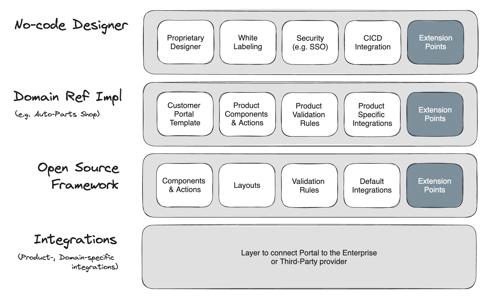

# LibreForge Framework

## LibreForge Platform
LibreForge platform is WIX for enterprise - no code integrated development environment to let enterprises and agencies build user facing portals.



One of the main pillar of platform is open source LibreForge Framework.  
The open source nature of framework empowers organizations to avoid vendor lock by providing freedom of choice, 
enabling customization and control over the source code, ensuring long-term viability independent of vendor roadmaps,
promoting interoperability, and enhancing security through community-driven transparency and vigilance.

## State Management

There are two types of state in LibreForge - Shared & Page states. Shared state is not cleared on page switch, Page state - is cleared.

### Shared State

An example of Shared state usage is to keep the state of Loader, or keep the session information (like access token) and be sure that such information doesn't disappear, when user decides to move to another page. 
In other words, if we need the state to survive the page change, such state needs to be kept as shared.

E.g. if you inspect the default [RouteToPageAction](https://github.com/getlibreforge/libreforge-framework/blob/main/src/actions/RouteToPageAction.ts) action, you will notice, that such action clears the page state, i.e.

```
dispatch.app.cleanCurrentPageState({})
```

### Page State

Page state instead is used to keep the currently visible components values, metadata, etc - everything, which is needed to render the page, submit the data to backend, etc. 
On page change such data needs to be removed, as it isn't relevant for another page components.

Developer can assign [DebugStateAction](https://github.com/getlibreforge/libreforge-framework/blob/main/src/actions/DebugStateAction.ts) as the 'on click action' to the Button component 
to be able to debug state at a runtime (for dev testing purposes only). Such action requires the `State Type` parameter to be provided, which is either `shared` or `page`.

## Framework Abstractions

This section delineates the framework's provided abstractions, essential for implementing a standardized collection of components, actions, etc. 
Furthermore, it defines the guiding principles of design that developers are expected to adhere to when crafting custom implementations.

### AbstractAction 

The framework furnishes a set of preconfigured UI actions, ready to be attached to UI components and triggered by the end-users, such as those triggered by button clicks. 
E.g. the actions triggered by the button click.
For instance, the [FormSubmitAction](https://github.com/getlibreforge/libreforge-framework/blob/main/src/actions/FormSubmitAction.ts) is usually attached to the [FormSubmitButton](https://github.com/getlibreforge/libreforge-framework/tree/main/src/components/FormSubmitButton) component.
Each action possesses unique characteristics, delineating specific conventions that developers must acknowledge and adhere to.

The framework offers flexibility beyond predefined actions, empowering developers to introduce custom actions seamlessly, 
thereby extending functionality accessible to both Designer and End Users Portal.

A prime illustration of this flexibility is evident in `librepackage-security-oauth2-google`, 
which provides Google based login capabilities, one of the enablement is [OAuth2GoogleRedirectAction](https://github.com/getlibreforge/librepackage-security-oauth2-google/blob/main/src/actions/OAuth2GoogleRedirectAction.ts).
This action initiates the OAuth 2.0 Authorization Code flow and is Google specific.

By inspecting the `AbstractAction` class, developers can understand, what is being available to the action at a time of execution.

```
@injectable()
export abstract class AbstractAction {

  abstract execute(context: ActionExecutionContext): Promise<{ next: boolean, result: any }>;
```

The `ActionExecutionContext` defines the next objects available during the action execution:

- `componentId` - id of a component, the action is attached to and which has triggered it
- `collectionRefIdx` - if UI component is rendered by iterating the collection (e.g. as it is done by `forEach` component), then index of collection item is propagated to an action execution
- `args` - and object that keeps the value for action arguments, as it was defined during design time. E.g. if that's the `FetchAction`, then that one require `url` argument to be defined during the design time
- `pageComponents` - page definition, i.e. all the components on a page, which is rendered. So that developer can get the component object by the `componentId`
- `currentPageState` - object, which represents the temporary state (it's cleaned during the page switch) the current active page works with. All the components write to / read from this state
- `sharedState` - object representing the state, which is capable to survive the page change. Such state is used to store the `security token` or `loader state`
- `dispatch` - Redux dispatcher to let developer call reducers and change the `currentPageState` or `sharedState` during action execution
- `snackbar` - to let developer show temporary end user notification
- `router` - react router to let the end user be routed to another page
- `container` - `IoC/DI` container to let reach any of the discoverable components / services / etc
- `prevExecutionState` - currently the object, which contains the result of previous action execution. I.e. there may be multiple actions attached to the `Button` and these actions are executed one by one. It is possible to have a scenario, when 2nd action needs to work with result of 1st action execution (e.g. response from server)
- `pagination` - pagination details (page, size), in case the action is executed in pagination context 

As we can see the plenty of capabilities are made available to the `action` - it can interact with user, read / change the state, redirect and literally access any service through the `IoC/DI` context. 

### ComponentProvider

A "component provider" serves as an abstract interface enabling developers to seamlessly integrate new UI components. 
It acts as a conduit for the LibreForge framework to detect and incorporate these components, 
subsequently making them accessible to both Designer and the Portal.

To better understand the implementation, check
- [ButtonProvider](https://github.com/getlibreforge/libreforge-framework/blob/main/src/components/Button/ButtonProvider.tsx)
- [ButtonComponent](https://github.com/getlibreforge/libreforge-framework/blob/main/src/components/Button/ButtonComponent.tsx)
- [Binding](https://github.com/getlibreforge/libreforge-framework/blob/main/src/Bindings.ts#L66)

The Designer or Portal discovers about the component through the IoC/DI context, we make the component available by binding it to the context (see the binding details above). 
Then that's not the component itself, but the component provider the Designer & Portal deal with.

The `ButtonProvider` abstract class looks like

```
@injectable()
export abstract class ComponentProvider {
  abstract getCategory(): ComponentCategory;

  abstract getIcon(): ReactElement;
  abstract getName(): string;  
  abstract getPreview(...): ReactNode;

  abstract getInspectorControls(): {
    control: InspectorControlEnum;
    props: any;
  }[];

  abstract getDefaultProps(): any;
  abstract isContainer(): boolean;
}
```

where 
- `getCategory` - defines the category under which the component is rendered in Designer. The next categories are available right now `layout`, `basic`, `fields`, `forms`, `wizard`, `tools`, `experimental`
- `getIcon` - icon rendered in Designer
- `getName` - rendered in Designer, needs to be unique, as later it is stored in application configuration and is used to render the component on UI
- `getPreview` - component itself
- `getInspectorControls` - component specific controls enabled in Designer, e.g. `FormSubmitButton` needs url, `Button` doesn't need it
- `getDefaultProps` - default values for components properties
- `isContainer` - tells to Designer, that other components are droppable to the current one or not

For more information about the collection of components provided by the framework see the list of docs and read about each component separately in https://github.com/getlibreforge/libreforge-framework/tree/main/docs 

### AbstractValidationRule

This abstraction defines the validation rules for UI input components, which are executed upon form submission. 
I.e. during [FormSubmitAction](https://github.com/getlibreforge/libreforge-framework/blob/main/src/actions/FormSubmitAction.ts) execution.

Inspect [LengthBetweenValidationRule](https://github.com/getlibreforge/libreforge-framework/blob/main/src/validation/LengthBetweenValidationRule.ts) to understand the implementation by an example.

### AbstractCallbackHandler

The callback handler enables developers to expose additional URLs, facilitating actions such as handling user 
clicks within an email or accepting redirects from third-party services along with associated data for processing.

The perfect example is the implementation of OAuth 2.0 Authorization Code protocol, 
when Service Provider needs to accept the redirect from Identity Provider with authorization code issued. 
This exact example is implemented in `librepackage-security-oauth2-google`, see [OAuth2GoogleCallbackHandler](https://github.com/getlibreforge/librepackage-security-oauth2-google/blob/main/src/callback/OAuth2GoogleCallbackHandler.ts)

### Security

LibreForge Framework provides the security abstractions to let developers implement end user authentication / authorization.

[AuthorizationManager](https://github.com/getlibreforge/libreforge-framework/blob/main/src/security/AuthorizationManager.ts) is an internal implementation, which drives the decision-making and undertakes the security related actions.
[AbstractAuthorizationConfigProvider](https://github.com/getlibreforge/libreforge-framework/blob/main/src/security/AbstractAuthorizationConfigProvider.ts) tells to `AuthorizationManager`, which of urls are considered public and which are private. Developers shall override default implementation in projects in order to define project specific configuration. 

E.g. inspect [libreforge-general-dashboard-demo / DefaultAuthorizationConfigProvider](https://github.com/getlibreforge/libreforge-general-dashboard-demo/blob/main/src/DefaultAuthorizationConfigProvider.ts). This is an example of end user portal with security configuration defined.

Additionally, `AbstractSessionRefreshStrategy` defines the mechanism to refresh the user session, e.g. [OAuth2SessionRefreshStrategy](https://github.com/getlibreforge/librepackage-security-oauth2-google/blob/main/src/security/OAuth2SessionRefreshStrategy.ts) defines the Google OAuth 2.0 specific implementation.
